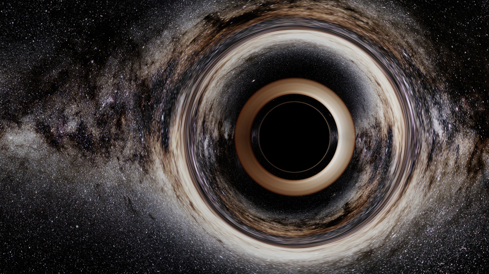

# Schwarzschild Black Hole Renderer

基于 **WebGPU / WebGL2** 的交互式 Schwarzschild 黑洞实时成像实验。

程序在 GPU fragment shader 中反向积分过去指向的零测地线，并用同一条光路计算事件视界捕获、理想薄吸积盘交点、相对论频移，以及全天球银河背景的引力透镜成像。项目面向实时可视化与教学演示，不是 Kerr、GRMHD 或高精度辐射转移求解器。



<sub>项目在 Apple Silicon 上运行 WebGPU/Metal 的 5120×2576 实际截图，保留控制面板与后端、输出模式、帧率等运行状态。银河素材：ESO/S. Brunier；经本项目测地线追踪变形、合成并转码，原素材按 [CC BY 4.0](https://creativecommons.org/licenses/by/4.0/) 使用；完整来源见 [`assets/SOURCES.md`](./assets/SOURCES.md)。</sub>

## 核心特性

- **逐像素零测地线积分**：使用 Störmer–Verlet 数值积分 `u'' = -u + 3u²`，而不是屏幕空间扭曲。
- **统一光路合成**：同一条光线负责黑洞捕获、多个盘面交点和天空逃逸方向，银河与恒星自然产生临界环和高阶像。
- **相对论薄盘显示**：包含 Schwarzschild 圆轨道频移、`g⁴` 总辐射强度变换、近似黑体色度、表面光学深度与肢暗化。
- **实时程序化盘面**：受盘湍流启发的有限寿命噪声场随局部 Kepler 角速度平流；它是视觉近似，不是 MHD 模拟。
- **WebGPU 优先、WebGL2 回退**：根据浏览器实际暴露的 GPU limits、纹理尺寸和 framebuffer 能力选择路径，不按芯片型号硬编码。
- **渐进式天空资源**：仓库内置 ESO 6K 与 4K 回退；可选加载 ESA/Gaia 16000×8000 全天图。
- **能力检测与 HDR 降级**：尝试请求 Display-P3、FP16 与扩展范围输出，并检查浏览器是否保留配置；否则依次退回 P3 SDR、sRGB SDR 或 WebGL2。

## 快速开始

项目没有构建步骤，也不需要安装 JavaScript 依赖。Python 仅用于启动静态服务器。

```bash
git clone https://github.com/ShuoleiWang/blackhole.git
cd blackhole
python3 -m http.server 4173
```

打开 <http://localhost:4173>。WebGPU 需要 `localhost` 或 HTTPS 安全上下文；不支持 WebGPU 时程序会自动尝试 WebGL2。

仓库内的 6K 银河背景可以直接运行。若希望使用约 236 MiB 的 Gaia 16K 全天图，可额外执行：

```bash
./scripts/fetch_gaia_sky.sh
```

下载脚本会从 ESA 官方地址获取原图，并在安装前校验固定 SHA-256；该大文件不会提交到 Git。

## 交互

| 操作 | 效果 |
| --- | --- |
| 鼠标拖动 / 单指拖动 | 改变观测相位与圆轨道所在平面 |
| 滚轮 / 双指缩放 | 改变观测半径 |
| 双击画面 | 重置观测视角 |
| 方向键 | 微调相位与轨道平面 |
| `0` | 令观测轨道与吸积盘共面，进入严格侧视 |
| `+` / `-` | 减小 / 增大观测半径 |
| 空格 | 暂停 / 继续物理时间 |

“科学真色 / 哈勃调色”只改变显示映射与轻量 PSF，不改变测地线、盘面遮挡或频移。

## 运行参数

| URL 参数 | 用途 |
| --- | --- |
| `?renderer=webgl` | 强制使用 WebGL2 回退路径 |
| `?hdr=0` | 关闭扩展 HDR，使用稳定的 SDR 输出 |
| `?sky=high` | 固定使用仓库内的 ESO 6K 银河背景 |
| `?sky=ultra` | 启动时阻塞尝试本地 Gaia 16K 背景 |
| `?presentation=1` | 隐藏控制面板与状态栏，适合展示和截图 |

参数可以组合，例如：

```text
http://localhost:4173/?presentation=1&sky=high&hdr=0
```

## 渲染管线

1. 从圆轨道观测者的局部共动标架生成相机光线。
2. 做 Lorentz 变换，进入局部 Schwarzschild 静态标架。
3. 在 fragment shader 中积分零测地线并判断捕获、逃逸和盘面交叉。
4. 按从近到远的顺序累积薄盘辐射与透过率，再采样逃逸方向上的全天球背景。
5. WebGPU 在 FP16 中间目标上完成光追，再根据实际显示能力输出扩展 HDR 或 SDR；WebGL2 提供 sRGB/SDR 回退。

主要实现：

- [`src/shaders.js`](./src/shaders.js)：WGSL / GLSL 测地线、薄盘辐射、天空采样与后处理
- [`src/webgpu-renderer.js`](./src/webgpu-renderer.js)：WebGPU 双阶段渲染与 HDR/P3 配置协商
- [`src/webgl-renderer.js`](./src/webgl-renderer.js)：WebGL2 硬件回退与半浮点 framebuffer 探测
- [`src/main.js`](./src/main.js)：相机轨道、物理参数、交互和动态画质

## 模型范围与限制

| 已实现 | 当前边界 |
| --- | --- |
| 非旋转 Schwarzschild 时空 | 不支持 Kerr 自旋和 frame dragging |
| GPU 零测地线数值积分 | 临界曲线最窄区域受有限步数与像素采样限制 |
| `r = 6M` 至 `18M` 的理想零厚度薄盘 | 不含有限尺度高度和三维体辐射积分 |
| 引力 / Doppler 频移与实时薄盘发射近似 | 不是完整光谱、偏振或自洽辐射转移 |
| 受湍流启发的程序化盘面结构 | 不求解磁流体方程，也不声称复现真实 MRI 数据 |
| WebGPU 主路径、WebGL2 回退 | HDR、P3、FP16 与 16K 纹理由运行时能力决定 |

几何单位、临界轨道、侧视图像和颜色不对称的详细说明见 [`docs/physics-notes.md`](./docs/physics-notes.md)。

## 兼容性与 HDR

渲染器没有 M3、M4 或其他 GPU 型号的专用分支。它依据浏览器返回的 texture limits、canvas 配置、半浮点 framebuffer 完整性以及显示动态范围逐级选择能力，因此同一代码可以在不同 Apple Silicon 上使用相应的 WebGPU/Metal 或 WebGL2/Metal 路径。

- **M3 Pro**：已实测 WebGPU/Metal、WebGL2/Metal、Display-P3 FP16 路径、SDR 降级和 16K 后台升级。
- **M4**：设计上使用相同的能力协商路径，不依赖 M4 独有功能；当前仓库尚未记录 M4 实机 smoke test。
- **其他平台**：能否启用 WebGPU、HDR 或大纹理由浏览器、操作系统、驱动、显示器及窗口所在屏幕共同决定。

右上角状态栏显示实际后端、GPU、输出模式、FPS 与内部渲染分辨率。动态画质会在用户设置的上限内调整普通光线步数与分辨率；临界冲量参数附近的光线保持更高积分预算。

## 验证

```bash
python3 scripts/verify_physics.py
```

数值回归覆盖：

- 临界冲量参数 `b_c = 3√3 M`
- 弱场偏折与 `4M/b` 的一致性
- 有限距离观察者的阴影角直径
- 零测地线积分守恒量
- 184 / 288 步实时预算下的捕获与逃逸行为

该脚本验证的是一组明确的 Schwarzschild 数值性质，不等价于完整画面、辐射模型或所有 GPU 的自动化验证。当前仓库尚未配置 GPU 图像回归 CI。

## 天空素材与署名

- **ESA/Gaia/DPAC · A. Moitinho**：可选 16000×8000 Gaia EDR3 全天图，CC BY-SA 3.0 IGO。
- **ESO/S. Brunier**：仓库内置 6000×3000 银河摄影背景，CC BY 4.0。
- `assets/deep-field.webp`：由仓库脚本生成的备用深空素材，不是默认背景。

下载地址、处理方式、哈希和完整许可信息见 [`assets/SOURCES.md`](./assets/SOURCES.md)。第三方素材不会因本项目代码未来采用某种许可证而被重新授权。

## 许可证

当前仓库尚未声明项目代码许可证。第三方天空素材与 vendored 依赖仍分别遵循其原始许可；在选择项目代码许可证前，请不要假设仓库内容已按 MIT、Apache-2.0 等许可证授权。
