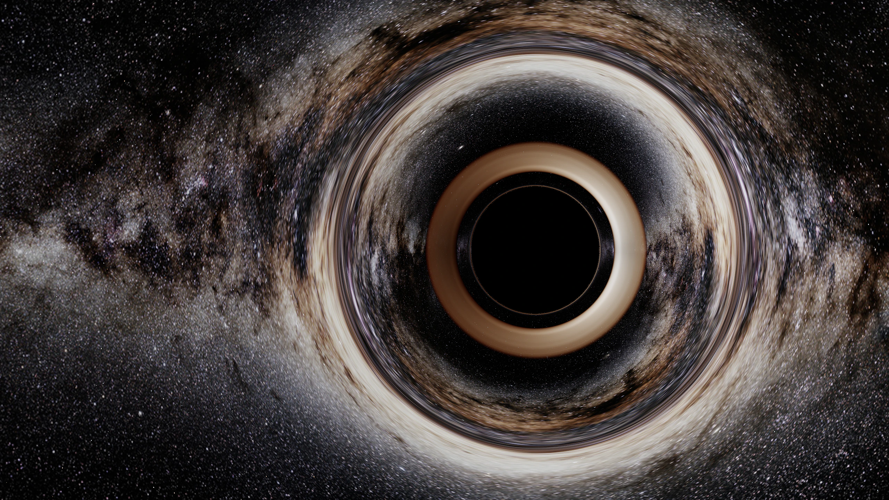

# Relativistic Black Hole Renderer

**English** | [简体中文](./README.zh-CN.md)

[](./LICENSE)

An interactive, real-time black-hole renderer built with **WebGPU and WebGL2**.
The root URL opens the real-time vacuum binary scene; the independent
`?scene=binary-dual-disk` route adds two idealized mini-disks, the legacy
`?scene=binary-approx` URL remains compatible, and `?scene=schwarzschild`
opens the interactive single-hole scene.

The root scene is a production-oriented **WebGPU strong-field binary ray
tracer**. Each pixel follows a past-directed null Hamiltonian ray, integrated
with fourth-order Runge-Kutta, through a frame-frozen superposition of
Kerr-Schild black holes and classifies the result as `captured` (at the
innermost photon orbit), `escaped`, or `unresolved`. The merger transitions
smoothly to an analytic single-Kerr remnant. Mouse or touch input changes the
camera; the next submitted frame contains only rays from that new camera and
never reuses a fixed transfer map or queues stale viewpoints.

Pinned `SXS:BBH:0001` Lev5 data anchors the complex `h22` waveform, source
events, and final mass and spin. A declared quasi-circular PN/EOB-like adapter
derives renderer coordinates from the waveform frequency. The
gauge-dependent SXS apparent-horizon centroid separation and phase remain
visible as labelled evidence, but **never become WebGPU black-hole
positions**.

This is a strong-field **approximate fast-light metric**, not a
constraint-solved numerical-relativity spacetime. It does not consume an SXS
near-zone metric, evolve the metric along each ray, or model luminous plasma.
Accordingly, it is not full-NR slow-light ray tracing, GRMHD, or complete
radiative transfer. WebGL2 deliberately falls back to the previous weak-field
preview instead of limiting the WebGPU/Metal implementation to backend parity.

The dual-disk route keeps that scientific boundary explicit. It adds two
frame-frozen analytic thin-disk surfaces with finite surface optical depth;
their ISCO, Eggleton
Roche-lobe truncation, zero-torque temperature profile, local orbital motion,
frequency transfer, `g⁴` intensity transfer, and mutual opacity are evaluated
along the production strong-field rays. Visible colour is integrated over a
15-sample 380–780 nm CIE response rather than assigning a fixed RGB or mapping
all UV-dominated power into display white. It is an idealized emission proxy,
not SXS matter data or GRMHD; stable mini-disks shut off before merger and no
post-merger disk is invented.

The explicit Schwarzschild scene numerically integrates past-directed null
geodesics on the GPU. A single ray path determines horizon capture, idealized
disk intersections, frequency shifts, and lensing of an all-sky Milky Way
background.

The scientific `?scene=transfer-map-reference` path exercises the
transfer-map pipeline with project-generated stationary analytic
**Schwarzschild and Kerr** references. The Kerr product uses the pinned
`SXS:BBH:0001` remnant spin only; its metric and pixels are analytic,
project-generated data, not SXS near-zone data. Both fixed 1024×576 cameras
contain no accretion disk and are **not numerical relativity**. They validate
offline ray generation, authenticated playback, GPU consumption, diagnostics,
and sky composition. They are calibration and regression oracles, not merger
renderers.

The `?scene=supernova-ia` route renders a **Type Ia supernova** from start to
finish: a Roche-lobe-filling double white dwarf, the helium-shell and core
detonations, the fireball, the radioactively powered photosphere and the
nebular phase. A grey flux-limited radiation-diffusion solution with
⁵⁶Ni→⁵⁶Co→⁵⁶Fe heating sets every temperature and luminosity (bolometric peak
1.1×10⁴³ erg/s at 17 d, as for SN 2011fe), and the WebGPU tracer integrates
emission and absorption through it with relativistic Doppler shifts and
light-travel delay. See [`docs/transient-physics.md`](./docs/transient-physics.md).



<sub>A 5120×2576 in-app screenshot of the WebGPU/Metal renderer running on Apple Silicon, with the controls and live backend, output, and performance readouts visible. Milky Way source: ESO/S. Brunier; geodesically transformed, composited, and transcoded by this project from an original used under [CC BY 4.0](https://creativecommons.org/licenses/by/4.0/). See [`assets/SOURCES.md`](./assets/SOURCES.md) for full provenance.</sub>

## Rendering products and roadmap

| Product layer | Status | Scientific boundary |
| --- | --- | --- |
| Root real-time vacuum binary scene | Implemented | WebGPU 3+1 Hamiltonian RK4 rays through a frame-frozen superposed Kerr-Schild fast-light approximation; SXS anchors waveform/events/remnant, not body coordinates |
| `?scene=binary-dual-disk` | Implemented | Same strong-field lensing plus two idealized Roche/ISCO-truncated thin mini-disks; no GRMHD, self-consistent spectral radiative transfer, or post-merger emission model |
| `?scene=schwarzschild` | Implemented | Interactive single-hole Schwarzschild geodesics and an idealized disk |
| `?scene=supernova-ia` | Implemented | Double-detonation Type Ia supernova: Roche-geometry binary, kinematic detonations, grey radiation diffusion and emission–absorption transport; no hydrodynamics, non-LTE spectra or polarization |
| Stationary Schwarzschild/Kerr workbench | Implemented | Fixed-camera analytic vacuum calibration, authenticated delivery, and regression oracles; not a merger renderer |
| WebGL2 binary fallback | Implemented | Explicit legacy weak-field preview with no claim of physical parity with the WebGPU strong-field path |
| Offline single-Kerr spectral renderer | Rewrite planned | The earlier pure-Python prototype was removed from `main` pending a lean rewrite; it is preserved on the `archive/offline-v1` branch |
| Four-dimensional NR slow-light offline rendering | Planned | Requires ray bundles/Jacobi fields and, for luminous output, separately sourced GRMHD/GRRT, spectral, and polarization data |

[`docs/rendering-modes.md`](./docs/rendering-modes.md) defines these two
development routes, their permitted claims, and why transfer-map v1 remains a
camera-specific vacuum escape-transfer ABI rather than a complete radiative
rendering format.

## Key features

- **Interactive Schwarzschild geodesics** — The explicit single-hole scene uses Störmer–Verlet integration of `u'' = -u + 3u²` instead of a screen-space distortion effect.
- **Unified ray-path composition** — A single traced ray handles capture, multiple disk-plane intersections, and the final sky escape direction, producing critical-curve arcs and higher-order images.
- **Relativistic disk appearance** — An optically thick Novikov–Thorne disk from the ISCO to 30 M with exact Schwarzschild circular-orbit frequency shifts. Colour and brightness come from a 15-sample CIE integral of the colour-corrected blackbody at the observed temperature times the transferred bolometric intensity `g⁴F`, so Doppler and radial contrasts are those of the visible band; flux-normalized electron-scattering limb darkening. Exposure is anchored to a static emitter at the flux peak.
- **Real-time procedural disk structure** — Turbulence-inspired, finite-lifetime noise is advected at the local Keplerian angular velocity. This is a visual approximation, not an MHD simulation.
- **Source-anchored binary evolution** — The root scene lazy-loads a
  2,732-sample, approximately 198 KiB track derived from
  `SXS:BBH:0001/Lev5`: real A/B horizon-centroid coordinate separation and
  phase, CoM-corrected extrapolated `h22`, source events, and exact remnant
  metadata. Only the waveform, events, and remnant parameters anchor the
  strong-field renderer; centroid channels remain labelled, gauge-dependent
  diagnostics.
- **Unified spacetime provider** — A 44-float aligned frame ABI supplies
  explicit body/remnant positions, velocities, spins, optional companion
  attenuation (off by default), numerical guards, and a C² binary-to-remnant
  transition. The CPU oracle and WGSL share
  the same 3+1 contract.
- **Strong-field WebGPU transport** — The production shader evaluates
  arbitrary-spin Kerr-Schild terms, analytic spatial metric derivatives,
  lapse, shift, and inverse spatial metric, and integrates the reduced null
  Hamiltonian with classical RK4 whose steps scale with the distance to the
  nearest hole. Frozen body positions enter unboosted, so each term keeps its
  horizon at `r = r+`. The exact post-merger limit is a single Kerr metric with
  the pinned SXS remnant mass and spin.
- **Photon-orbit capture and fail-closed outcomes** — A ray inside an
  innermost (prograde) photon orbit and moving inward cannot escape an
  isolated Kerr hole, so it is captured there; radii are scaled by each term's
  metric weight during the merger blend. Metric failures, exhausted budgets
  and rays slowed below coordinate speed 0.2 near a horizon (photons peeling
  off a trapped surface) inside an unscaled photon orbit are captures; failures
  elsewhere remain visibly `unresolved` and are never sampled as sky.
- **Interactive binary transport** — The waveform timeline can be scrubbed,
  paused from either transport control, and replayed with an optional
  presentation-only `0.12×` slow-motion window around merger. Slow motion
  changes wall-clock playback only, never the source time or physics data.
- **M3 Pro quality-locked scheduling** — One WebGPU frame may be in flight at
  a time, preventing stale-camera queue buildup. Motion and dragging retain the
  full Retina backing raster up to 12 MP with the `interactive` RK4 tier; slow
  frame timing may reduce throughput but cannot silently lower spatial
  resolution. Paused views retain the same raster and refine through the
  `balanced` and `fine` RK4 tiers.
- **Schwarzschild/Kerr calibration workbench** —
  `?scene=transfer-map-reference` authenticates one of two bundled 1024×576
  stationary maps before either backend consumes it. The Kerr reference
  numerically integrates separated null geodesics of the exact analytic Kerr
  metric, with a finite-distance BL-ZAMO, a constant-Kerr-r oblate capture
  surface, and continuation to infinity. These maps are stationary vacuum
  calibration oracles, not merger frames.
- **Inspectable scientific diagnostics** — Stable URL modes show sky,
  outcomes, lookback time, frequency shift, null residual, or projection
  error. Clicking a texel exposes its decoded canonical 32-byte record.
- **Type Ia supernova** — A 1.0 M☉ C/O white dwarf with a 0.016 M☉ helium
  shell accretes from a 0.6 M☉ white dwarf through a ballistic stream. The
  impact spot radiates at the local Eddington flux (1.0×10⁶ K,
  3.7×10³⁶ erg/s), and its light heats the donor's facing side to
  ~3×10⁵ K and the stream to 2–9×10⁵ K (reflection effect). The helium
  detonation, the core breakout and the fireball, faster towards the
  ignition side like the ejecta, follow energy-budgeted photosphere laws and
  hand off continuously to the ejecta;
  the surviving donor is struck and released at 1775 km/s. The homologous
  ejecta (0.515 M☉ ⁵⁶Ni, shadow cone, impact-axis stretch, orbital kick) are
  rendered from a grey flux-limited diffusion solution with
  Eddington–Barbier limb darkening, nebular radioactive emission, retarded
  time and relativistic Doppler.
- **Camera exposure and glare for self-luminous scenes** — The Type Ia scene
  exposes self-luminous surfaces near display white, not middle grey, and
  adapts like a camera, so flashes overexpose before the exposure follows. Veiling glare uses the CIE 146:2002 disability-glare shape at the
  strength of a good camera lens (~2% veiling-glare index), computed as a
  quarter-resolution Gaussian pyramid added in the post pass (~1.1 ms per
  native frame). Diagnostic false colour and the black-hole scenes never
  receive it.
- **Sparse radiance tracing** — Moving Type Ia frames trace one node per 4×4
  pixels and interpolate only where 12 neighbouring nodes see the same object
  and the bilinear error bound stays under 0.4% of the display value; the
  photospheric phases drop from 23–35 ms to 4–5.4 ms per native 3456×2234
  frame on an M3 Pro at 57–64 dB PSNR.
- **Isolated scene architecture** — Scene descriptors and shader bundles keep the root binary scene, explicit Schwarzschild scene, and fixed-camera scientific references from silently sharing physical assumptions.
- **WebGPU production, explicit WebGL2 fallback** — WebGPU/Metal runs the
  strong-field binary model. WebGL2 remains a labelled weak-field
  compatibility preview; the two backends are intentionally not presented as
  physically equivalent.
- **Strict full-resolution sky assets** — The ESO photograph is uploaded at its
  original 6000×3000 pixels and the optional ESA/Gaia map at 16000×8000.
  Explicit selection never downsamples or silently substitutes a smaller map.
- **Capability-negotiated HDR** — Requests Display-P3, FP16, and extended-range output where available, then falls back to P3 or sRGB SDR. WebGL2 is used when WebGPU initialization is unavailable or fails.

## Quick start

There is no build step and no JavaScript package installation. Python is used only to serve the static files.

```bash
git clone https://github.com/ShuoleiWang/blackhole.git
cd blackhole
python3 -m http.server 4173
```

Open <http://localhost:4173>. WebGPU requires a secure context such as `localhost` or HTTPS; the application automatically attempts the WebGL2 fallback when WebGPU is unavailable.

The interface defaults to English and can be switched to Simplified Chinese
from the observation panel. The choice persists across all scene routes.

The root URL opens the real-time vacuum binary scene. Open
<http://localhost:4173/?scene=binary-dual-disk> for the independent dual
mini-disk emission scene. The legacy
<http://localhost:4173/?scene=binary-approx> URL selects the same scene.
Open <http://localhost:4173/?scene=schwarzschild> for the interactive
single-hole renderer, or open
<http://localhost:4173/?scene=transfer-map-reference> for the fixed-camera
Schwarzschild transfer-map reference, or append `&reference=kerr-remnant` for
the stationary Kerr remnant-spin reference. Open
<http://localhost:4173/?scene=supernova-ia> for the Type Ia supernova. All
paths remain isolated.

The bundled 6K Milky Way background works immediately. To install the optional, approximately 236 MiB Gaia 16K map:

```bash
./scripts/fetch_gaia_sky.sh
```

The script downloads the original asset from ESA and verifies a pinned SHA-256 digest before installation. The large source file is intentionally excluded from Git.
The visible **天空素材 / Sky source** selector in the observation panel switches
between the ESO 6000×3000 photograph and the optional Gaia 16000×8000
scientific all-sky map while preserving the current scene, time, and renderer
parameters. Both selections are strict: a missing, incorrectly decoded, or
unsupported original asset fails visibly instead of loading a lower-resolution
fallback.

## Controls

| Input | Action |
| --- | --- |
| Mouse drag / one-finger drag | Change orbital phase and the observer's orbital plane |
| Wheel / pinch | Change observer radius |
| Double-click the canvas | Reset the view |
| Arrow keys | Fine-tune orbital phase and plane |
| `0` | Place the observer orbit in the disk plane for a strict edge-on view |
| `+` / `-` | Decrease / increase observer radius |
| Space | Pause / resume simulation time |

The single-hole scene retains its neutral science and stylized Hubble display
transforms. In the root strong-field scene, the same mode area exposes the
scientific sky as the primary image, with coordinate-lookback,
Hamiltonian-residual, and integration-cost views kept under advanced
diagnostics. False-colour diagnostics bypass exposure, the Hubble grade and
tone mapping, so their palettes reach the screen unchanged. Ray outcome and frequency-shift channels remain in the GPU result
and stationary scientific-reference workbench without occupying primary
binary-scene controls.

In the root binary scene, drag and zoom control the camera. Each rendered frame
constructs fresh camera rays and recomputes the active backend model; it does
not sample the fixed-camera transfer maps. WebGPU traces the strong-field
approximation, while a forced or automatic WebGL2 fallback is labelled as the
legacy weak-field preview. The transport button and Space pause or resume the
same timeline; the range control scrubs protocol time, and **Merger slow
motion** toggles a presentation-only `0.12×` rate from `t = -160 M` through
`t = 70 M`. The waveform strip is the real, CoM-corrected SXS
`Extrapolated_N2` `h22` mode, with peak amplitude at protocol `t = 0`.
Pausing the timeline and camera allows WebGPU to refine and accumulate a
sub-pixel-jittered linear-HDR result. The accretion control is disabled because
the source is a vacuum binary.

The dual-disk route shares the same camera, SXS evidence, timeline, and
strong-field quality policy. Its per-disk emission-proxy control is enabled
only on WebGPU. Each disk follows the provider-owned body state, shrinks with
`r_out=min(10M, 0.8 R_L)`, and turns off through a C² transition when its
Roche-truncated outer edge reaches the `6m_i` ISCO. WebGL2 remains a labelled
vacuum weak-field preview and disables the emission control.

The Type Ia scene reuses the timeline controls. The scrubber runs on a
presentation timeline that is linear through the orbit and the detonations and
logarithmic from seconds to 150 days; the rate readout states how much
physical time one wall second covers. **Camera follows expansion** keeps the
whole event in view (off freezes the physical camera distance), and the three
modes select auto-exposed true colour, sky-referenced exposure, or false colour
by ejecta composition. Exposure compensation spans ±4 EV and playback speed
0–4×.

The transfer-map workbench has a fixed camera and projection, so drag, zoom,
reset, motion, mass, accretion, and time controls are disabled. It can switch
between the Schwarzschild and Kerr references and display sky composition,
ray outcomes, lookback time, frequency factor, null residual, or projection
error. Click the canvas to inspect one canonical 32-byte ray record; arrow keys
move the selected texel, Shift accelerates movement, and Escape closes the
inspector. Exposure and display quality remain presentation controls.

## URL parameters

| Parameter | Purpose |
| --- | --- |
| root URL | Open the interactive WebGPU strong-field approximate binary tracer |
| `?lang=en\|zh-CN` | Select English or Simplified Chinese; English is the strict default and the choice is preserved across scene links |
| `?scene=binary-approx` | Legacy-compatible alias for the root binary scene |
| `?scene=binary-dual-disk` | Open the WebGPU strong-field binary with two idealized Roche/ISCO-truncated mini-disks; no GRMHD or post-merger emission model |
| `?scene=schwarzschild` | Open the interactive single-hole Schwarzschild geodesic and idealized-disk scene |
| `?scene=transfer-map-reference` | Open the fixed-camera stationary analytic Schwarzschild transfer-map reference; not NR and no accretion disk |
| `?scene=transfer-map-reference&reference=kerr-remnant` | Open the stationary analytic Kerr remnant-spin reference; not NR and no accretion disk |
| `&binaryTime=-16.8&paused=1` | Open the real-time binary scene at a reproducible protocol time in `M` and keep its timeline paused |
| `?scene=supernova-ia` | Open the Type Ia supernova (double-degenerate double detonation) |
| `&snTime=1468800&paused=1` | Open the Type Ia scene at a physical time in seconds after helium ignition (here ≈17 d, near peak) and keep it paused |
| `&diagnostic=sky\|outcome\|lookback\|frequency-shift\|null-residual\|projection-error` | Select a stable transfer-map workbench view |
| `?renderer=webgl` | Force the WebGL2 fallback path |
| `?hdr=0` | Disable extended HDR and use stable SDR output |
| `?sky=high` | Require the bundled ESO panorama at its original 6000×3000 size |
| `?sky=ultra` | Require the local Gaia panorama at its original 16000×8000 size |
| `?presentation=1` | Hide controls and status readouts for presentation or capture |

Parameters can be combined:

```text
http://localhost:4173/?scene=transfer-map-reference&reference=kerr-remnant&diagnostic=outcome&renderer=webgl&hdr=0
```

## Rendering pipeline

The explicit Schwarzschild path:

1. Generate camera rays in the local comoving frame of a circular-orbit observer.
2. Apply a Lorentz transformation into the local static Schwarzschild frame.
3. Integrate each null geodesic in the fragment shader and classify capture, escape, and disk-plane crossings.
4. Accumulate disk emission and transmittance from near to far, then sample the all-sky background in the escaped direction.
5. On WebGPU, ray trace into an FP16 intermediate target and select extended-range or SDR canvas output from the capabilities the browser preserves. WebGL2 provides an sRGB/SDR fallback.

The root binary path lazy-loads and integrity-checks a versioned SXS manifest
plus its compact sample asset. It unwraps the CoM-corrected complex `h22`
phase, obtains a bounded orbital frequency, applies the declared
`r/M=(MΩ)^(-2/3)` quasi-circular relation, and constructs center-of-mass body
positions and boost velocities. A quintic Hermite join preserves value, first
derivative, and second derivative from the common-horizon event to the
waveform peak. Gauge-dependent SXS centroid separation and phase are retained
only for labelled UI evidence and regression.

On WebGPU, each pixel first builds its camera direction in the rest frame of
a static observer (`u = ∂ₜ/α_s`), the same kind of camera as the Schwarzschild
scene. It stores the future-directed momentum of the photon arriving at the
camera, then advances the Hamiltonian flow with negative coordinate-time steps
so the traced path is past-directed. The shader
evaluates a frozen superposed Kerr-Schild metric through its exact low-rank
(Woodbury) inverse, which gives the lapse, shift and the null Hamiltonian in
closed form, and integrates

```text
H(x,p) = α sqrt(γⁱʲ pᵢ pⱼ) - βⁱpᵢ = -pₜ
```

with classical fourth-order Runge-Kutta, closed-form spatial derivatives, and
an exact energy-surface projection (H is homogeneous in p, so the projection
does not change the path). Rays terminate as captured at the innermost photon
orbit, escaped, or unresolved. The escape sphere lies well outside the camera,
where the ingoing Kerr-Schild coordinate direction already matches the
asymptotic sky direction to ~M b³/r⁴, so no weak-field tail is added; the
frequency factor uses the conserved asymptotic energy (the same `1/α_s` for
every sky pixel of the static camera). The approximate binary metric makes a
C² transition to the analytic Kerr remnant that starts once the separation
reaches 8.5 sqrt(m_A m_B) (t = −18.09 M for SXS:BBH:0001), before the
superposition would lose its Lorentzian signature between the holes. The image is then accumulated in linear FP16 HDR only while every
physical and camera revision is stationary, before the shared display
transform.

This pipeline is not a solved SXS near-zone spacetime: body locations come
from the declared analytic adapter, the metric is frozen along a ray, and the
photon-orbit capture surfaces are those of isolated Kerr terms rather than
computed apparent or event horizons, and the plain superposition makes each
hole's shadow roughly `2 m_companion / d` too large. The motion tiers use a
larger RK4 step fraction (sky errors near the holes of a few arcminutes, i.e.
several native-Retina pixels); the paused `fine` tier is the strictest settled
configuration (about 0.02–0.06′ near the holes). These policies trade numerical resolution for
latency and do not change the model's scientific classification. On WebGL2, the scene intentionally supplies the
old separation/phase compatibility payload to the labelled weak-field shader.

The reference path completes a separate fail-closed chain: select a reference
from a hard-coded trust registry; authenticate the exact manifest bytes,
sidecar, and chunks; validate the v1 schema, 32-byte records, coordinates,
outcomes, and accuracy; upload 589,824 records through the selected WebGPU or
WebGL2 resource path; select the nearest stored texel without blending ray
directions; and sample the panorama only for `escaped` outcomes before the
shared HDR/SDR stage.

Both products are single observations at `r = 40M`, with a 40-degree vertical
field of view and a fixed 1024×576 projection. The Schwarzschild map contains
557,772 escaped and 32,052 captured rays. The Kerr map uses
`a/M = 0.686461676493`, a finite-distance BL-ZAMO, and ingoing Cartesian
Kerr-Schild manifest coordinates; it contains 558,684 escaped and 31,140
captured rays. Both have zero unusable records. They are analytic stationary
references, not NR spacetimes, binary-merger images, accretion disks, or
GRMHD/radiative-transfer results.

These references are retained as stationary regression oracles for both
development routes. The real-time route will continue to generate camera rays
on the GPU; the future offline route will need four-dimensional NR slow-light
ray bundles and separately versioned radiative products. It will not expand
the meaning of the v1 32-byte vacuum ABI.

Primary implementation files:

- [`src/main.js`](./src/main.js) — Scene selection, camera revisions,
  single-frame GPU backpressure, interaction, and adaptive quality orchestration
- [`src/shaders.js`](./src/shaders.js) — Explicit-scene WGSL/GLSL Schwarzschild geodesics, disk emission, sky sampling, and post-processing
- [`src/scenes/binary-approx-scene.js`](./src/scenes/binary-approx-scene.js) —
  Shared vacuum/dual-disk binary lifecycle, evidence-labelled SXS timeline,
  backend policy, and strong-field frame parameters
- [`src/scenes/binary-dual-disk-scene.js`](./src/scenes/binary-dual-disk-scene.js) —
  Isolated dual-mini-disk route wrapper
- [`src/scenes/binary-accretion-model.js`](./src/scenes/binary-accretion-model.js) —
  CPU reference for Eggleton truncation, Schwarzschild ISCO, zero-torque flux,
  temperature scaling, and C² annulus shutdown
- [`src/scenes/binary-dynamics-adapter.js`](./src/scenes/binary-dynamics-adapter.js) — Fail-closed browser loader, integrity checks, and deterministic dynamics interpolation
- [`src/scenes/binary-playback-clock.js`](./src/scenes/binary-playback-clock.js) — Scrubbing, frame-rate-independent playback, end hold, looping, and presentation-only slow motion
- [`src/strong-field-orbit.js`](./src/strong-field-orbit.js) — Waveform-phase
  unwrapping, frequency-radius orbit adapter, C² merger kinematics, and
  provider-frame production
- [`src/strong-field-spacetime.js`](./src/strong-field-spacetime.js) — CPU
  Kerr-Schild/3+1 physics oracle, provider ABI, Hamiltonian, and fail-closed
  domain checks
- [`src/strong-field-shaders.js`](./src/strong-field-shaders.js) — Production
  WebGPU low-rank Kerr-Schild Hamiltonian, static-observer camera, RK4 tracer,
  photon-orbit capture, outcomes, diagnostics, and the explicit WebGL2
  fallback declaration
- [`src/strong-field-quality.js`](./src/strong-field-quality.js) — M3 Pro
  interaction/refinement scheduler, resolution/step hysteresis, revision
  invalidation, and accumulation policy
- [`src/binary-shaders.js`](./src/binary-shaders.js) — Legacy weak-field binary
  tracer retained for the explicit WebGL2 fallback
- [`src/scenes/transfer-map-reference-scene.js`](./src/scenes/transfer-map-reference-scene.js) — Fixed-camera reference lifecycle and fail-closed loading UI
- [`src/transfer-map-loader.js`](./src/transfer-map-loader.js) — Browser-side manifest, sidecar, chunk, ABI, outcome, and accuracy validation
- [`src/transfer-map-shaders.js`](./src/transfer-map-shaders.js) — Matching nearest-texel WebGPU/WebGL2 consumers
- [`assets/transfer-maps/schwarzschild-reference-v1/manifest.json`](./assets/transfer-maps/schwarzschild-reference-v1/manifest.json) — Renderable 1024×576 analytic reference and nine hashed chunks
- [`scripts/generate_schwarzschild_transfer_map.py`](./scripts/generate_schwarzschild_transfer_map.py) — Deterministic offline generator
- [`scripts/verify_schwarzschild_transfer_map.py`](./scripts/verify_schwarzschild_transfer_map.py) — Independent stationary-physics verifier
- [`assets/transfer-maps/kerr-remnant-reference-v1/manifest.json`](./assets/transfer-maps/kerr-remnant-reference-v1/manifest.json) — Renderable 1024×576 analytic Kerr reference and hashed chunks
- [`scripts/generate_kerr_transfer_map.py`](./scripts/generate_kerr_transfer_map.py) — Deterministic Kerr null-geodesic generator with full-ray tolerance refinement
- [`scripts/verify_kerr_transfer_map.py`](./scripts/verify_kerr_transfer_map.py) — Independent finite-ZAMO shadow, Kerr-Schild identity, and fixed-step ray verifier
- [`docs/kerr-reference.md`](./docs/kerr-reference.md) — Kerr configuration, equations, validation boundary, and reproduction guide
- [`assets/scenes/binary-sxs-bbh-0001-v2.json`](./assets/scenes/binary-sxs-bbh-0001-v2.json) — Phase 2 source, scientific-status, event, integrity, error, renderer-boundary, and playback manifest
- [`assets/scenes/binary-sxs-bbh-0001-v2.samples.json`](./assets/scenes/binary-sxs-bbh-0001-v2.samples.json) — 2,732-sample compact SXS dynamics and waveform track
- [`scripts/generate_binary_sxs_dynamics.py`](./scripts/generate_binary_sxs_dynamics.py) — Offline, deterministic generator from three pinned official SXS files
- [`scripts/verify_binary_dynamics.py`](./scripts/verify_binary_dynamics.py) — Fail-closed Phase 2 source, asset, event, interpolation, remnant, renderer-boundary, and playback checks
- [`tests/binary-playback.test.mjs`](./tests/binary-playback.test.mjs) — Node tests for source anchors, interpolation, scrubbing, slow motion, end hold, and frame-rate independence
- [`assets/scenes/binary-pn-equal-mass-v1.json`](./assets/scenes/binary-pn-equal-mass-v1.json) — Legacy v1 PN/phenomenological asset, retained only for regression
- [`scripts/verify_binary_preview.py`](./scripts/verify_binary_preview.py) — Legacy PN contract and unchanged weak-field shader convergence regression
- [`docs/binary-model.md`](./docs/binary-model.md) — Binary scientific
  boundary, current real-time strong-field model, explicit WebGL2 fallback, and
  offline architecture
- [`docs/strong-field-equations.md`](./docs/strong-field-equations.md) —
  Superposed Kerr-Schild provider, past-directed Hamiltonian convention,
  photon-orbit capture semantics, and GPU frame ABI
- [`docs/strong-field-performance.md`](./docs/strong-field-performance.md) —
  M3 Pro quality tiers, one-frame backpressure, declared numerical tradeoffs,
  and progressive convergence
- [`docs/strong-field-ray-oracles.md`](./docs/strong-field-ray-oracles.md) —
  Independent CPU analytic-limit, capture/escape, spin-parity, and fail-closed
  acceptance gates
- [`docs/rendering-modes.md`](./docs/rendering-modes.md) — Implemented product
  layers, real-time strong-field route, offline NR/GRRT route, and claim ladder
- [`docs/nr-transfer-map-v1.md`](./docs/nr-transfer-map-v1.md) — Normative
  terminology, field semantics, safety rules, and status of the transfer-map v1
  protocol
- [`schemas/nr-transfer-map-v1.schema.json`](./schemas/nr-transfer-map-v1.schema.json) — Machine-readable transfer-map manifest schema
- [`assets/transfer-maps/contract-fixture-v1/manifest.json`](./assets/transfer-maps/contract-fixture-v1/manifest.json) — Small project-generated conformance fixture; it contains no NR-derived payload
- [`scripts/generate_nr_contract_fixture.py`](./scripts/generate_nr_contract_fixture.py) — Deterministically regenerate the conformance fixture
- [`scripts/verify_nr_contract.py`](./scripts/verify_nr_contract.py) — Fail-closed manifest, sidecar, coordinate-frame, and per-ray record validator
- [`tests/test_nr_contract.py`](./tests/test_nr_contract.py) — Positive and adversarial protocol regression tests
- [`src/scenes/supernova-ia-scene.js`](./src/scenes/supernova-ia-scene.js) —
  Type Ia scene lifecycle, camera auto exposure, quality tiers and the sparse
  opt-in
- [`src/scenes/transient-scene-host.js`](./src/scenes/transient-scene-host.js) —
  Shared transient panel, presentation-timeline transport and light-curve plot
- [`src/supernova-ia-shaders.js`](./src/supernova-ia-shaders.js) — WebGPU
  double-detonation tracer (binary, detonations, ejecta), sparse radiance
  pass, and the reduced WebGL2 fallback
- [`src/transients/`](./src/transients/) — Physical constants, CIE blackbody
  colour, homologous radiation diffusion, Roche binary, white-dwarf structure,
  presentation timeline, shared transient WGSL, and the Type Ia model
- [`docs/transient-physics.md`](./docs/transient-physics.md) — Transient
  physics, calibration against SN 2011fe, omissions and performance
- [`src/webgpu-renderer.js`](./src/webgpu-renderer.js) — WebGPU renderer,
  one-frame submission gate, FP16 ping-pong progressive accumulation, and
  HDR/P3 configuration negotiation
- [`src/webgl-renderer.js`](./src/webgl-renderer.js) — WebGL2 fallback and half-float framebuffer probing

## Model scope and limitations

| Scene / component | Implemented | Current boundary |
| --- | --- | --- |
| Explicit single black hole | Non-rotating Schwarzschild spacetime and numerical GPU null-geodesic integration | No Kerr spin or frame dragging; the narrowest critical-curve features remain sampling-limited |
| Explicit Schwarzschild accretion disk | Optically thick zero-thickness Novikov–Thorne surface from `r = 6M` to `30M`, exact circular-orbit frequency shifts, CIE visible-band photometry, and turbulence-inspired structure | No finite scale height, GRMHD, complete spectrum, polarization, or self-consistent radiative transfer |
| Binary coordinate dynamics | Waveform-frequency-anchored quasi-circular PN/EOB-like relation with analytic center-of-mass positions and velocities | Not a calibrated EOB Hamiltonian; SXS centroid separation/phase are gauge-dependent UI evidence and never renderer coordinates |
| Binary waveform | CoM-corrected `Extrapolated_N2` complex `h22`, aligned so its maximum amplitude is protocol `t = 0` | A far-zone waveform is not a near-zone metric and cannot determine camera-ray propagation |
| Binary merger/remnant data | Common apparent horizon at `t = -6.072285 M`; exact metadata remnant mass `0.951609417715 M` and spin vector `(-7.29520687012e-10, 7.40468371215e-10, 0.686461676493)` | The C² metric removal is an analytic transition, not reconstructed NR horizon geometry or recoil |
| Binary lensing | Per-pixel 3+1 null-Hamiltonian RK4 integration through frame-frozen superposed Kerr-Schild terms; exact single-Kerr post-merger limit includes frame dragging | Strong-field but approximate, frame-frozen (fast light), and not constraint-solved NR; photon-orbit capture uses isolated-Kerr radii |
| Root binary emission | Vacuum sky lensing with no accretion disk | Adding luminous plasma would require physical gas initial data, GRMHD, and radiative transfer |
| Dual-disk binary emission | Two moving thin surfaces with `6m_i` ISCOs, `0.8R_L` tidal truncation, zero-torque temperature, CIE visible-band response, invariant frequency transfer, `g⁴`, C² photospheric coverage, bounded analytic tidal structure, and finite optical depth | Idealized emission proxy; no SXS matter data, GRMHD, volumetric absorption, polarization, self-consistent spectral transfer, or post-merger disk |
| Stationary Schwarzschild reference | Fixed 1024×576 analytic vacuum map, authenticated chunks, nearest-texel WebGPU/WebGL2 playback | Fixed camera; no disk, NR source, time interpolation, or binary slow-light rays |
| Stationary Kerr remnant reference | Numerically integrated vacuum geodesics of the exact analytic Kerr metric at `a/M = 0.686461676493`, finite BL-ZAMO camera, oblate Kerr-r capture surface, authenticated playback and diagnostics | Uses only the SXS remnant spin parameter; no SXS near-zone metric, binary time dependence, emission, or NR-derived pixels |
| NR transfer-map protocol | Versioned schema, deterministic synthetic fixture, fail-closed validators, reference consumer, and regression tests | The runtime is proven with analytic data only; no NR-derived transfer map is bundled |
| Type Ia supernova | D6 binary with an exact Roche donor and ballistic stream; kinematic helium and core detonations with energy-budgeted breakout photospheres; grey flux-limited diffusion with Ni/Co heating and γ-ray transport; retarded-time, Doppler-shifted emission–absorption rendering | Grey transport, one-dimensional in velocity with analytic asymmetries; colour temperature from the observed B−V track; no hydrodynamics, non-LTE spectra, early-excess physics or polarization |
| Shared renderer | WebGPU strong-field production path with one in-flight frame and stationary FP16 accumulation; WebGL2 weak-field fallback | HDR, P3, FP16, and 16K textures depend on runtime capabilities; HDR and accumulation do not improve the underlying metric model |

See [`docs/rendering-modes.md`](./docs/rendering-modes.md) for the product
layers and two development routes,
[`docs/physics-notes.md`](./docs/physics-notes.md) (currently in Simplified
Chinese) for the real-time Schwarzschild model,
[`docs/kerr-reference.md`](./docs/kerr-reference.md) for the stationary Kerr
product, [`docs/binary-model.md`](./docs/binary-model.md) for the binary model
boundary, and the
[`strong-field equations`](./docs/strong-field-equations.md),
[`M3 Pro scheduler`](./docs/strong-field-performance.md), and
[`independent ray oracles`](./docs/strong-field-ray-oracles.md) notes for the
implemented real-time path. [`docs/transient-physics.md`](./docs/transient-physics.md)
covers the Type Ia supernova.

## M3 Pro compatibility and HDR

The current hardware target is **M3 Pro**. Texture limits, canvas formats,
half-float framebuffer completeness, display range, and both original-size sky
assets are checked at runtime; this document makes no separate M4 compatibility
claim. The ESO 6000×3000 and Gaia 16000×8000 paths are both part of manual
acceptance.

The upper-right status bar reports the active backend, available adapter label,
output mode, completed-frame throughput, and internal render resolution. The
strong-field scheduler prevents WebGPU work from queueing behind one in-flight
Metal frame, but it no longer trades resolution for frame rate. Motion and
dragging use the native device-pixel ratio up to the 12 MP M3 Pro ceiling with
the `interactive` RK4 tier; paused refinement uses the `balanced` and then
`fine` tiers at the same raster.
For example, a 1280×720 CSS viewport renders at 2560×1440 on a 2× Retina display,
and a 1836×1376 viewport renders at 3672×2752. These settings can stutter by
design; completed-frame timing is telemetry rather than authority to downscale.
Moving frames trace one ray per 4×4 pixels first and interpolate the escape
direction only where the lens map is provably smooth (bilinear error below
0.25 px, never across captures, disks or critical curves); all other pixels
are traced. On an M3 Pro a full-screen 3456×2234 Retina raster then takes
about 11 ms per `interactive` frame (36 ms with every pixel traced; about
20 ms during the merger blend) and 96 ms per `fine` sample; see
[`docs/strong-field-performance.md`](./docs/strong-field-performance.md).

## Validation

The renderer itself has no build step. The validation suite additionally
requires a current Node.js executable on `PATH`; set `NODE_BINARY` when only
`verify_strong_field.py` needs an explicit executable path.

```bash
python3 scripts/verify_physics.py
python3 scripts/verify_binary_dynamics.py
python3 scripts/verify_strong_field.py
node --test tests/*.test.mjs
python3 scripts/verify_binary_preview.py
PYTHONDONTWRITEBYTECODE=1 python3 scripts/verify_nr_contract.py
PYTHONDONTWRITEBYTECODE=1 python3 -m unittest tests/test_nr_contract.py
PYTHONDONTWRITEBYTECODE=1 python3 scripts/verify_nr_contract.py assets/transfer-maps/schwarzschild-reference-v1/manifest.json
PYTHONDONTWRITEBYTECODE=1 python3 scripts/verify_schwarzschild_transfer_map.py
PYTHONDONTWRITEBYTECODE=1 python3 -m unittest tests/test_schwarzschild_transfer_map.py
PYTHONDONTWRITEBYTECODE=1 python3 scripts/verify_nr_contract.py assets/transfer-maps/kerr-remnant-reference-v1/manifest.json
PYTHONDONTWRITEBYTECODE=1 python3 scripts/verify_kerr_transfer_map.py
PYTHONDONTWRITEBYTECODE=1 python3 -m unittest tests/test_kerr_transfer_map.py
node --test tests/transfer-map-runtime.test.mjs
```

With the static server running on an M3 Pro, open
<http://localhost:4173/tests/strong-field-gpu-probe-browser.html> to execute
the exact 116-float dual-disk production WGSL as a WebGPU compute corpus. The
page first compiles every production WGSL module and fails on any compilation
error, then reads back both disk radiance, transmittance, and fail-closed state
for combined, A-only, B-only, repeated, and dark-disk cases; a passing page is
a native-backend numerical check, not a screenshot comparison. No automated
test executes the WGSL tracers; the Node suite checks their source contract and
the CPU oracles.

The transient tests check blackbody photometry (luminous efficacy, Planckian
locus, 6500 K neutral point), energy conservation of the radiation-diffusion
solver (Katz integral) and its Arnett, convergence and adiabatic limits, and
the presentation timeline. For the Type Ia scene they pin the Roche/Kepler
binary, the ⁵⁶Ni mass, peak time and luminosity, Arnett ratio, bolometric
decline, photospheric velocity and γ-ray trapping time against normal SNe Ia,
the breakout energy budget, the donor strike time, the slot-for-slot agreement
of the packed uniforms with the WGSL struct, and the scene's tier-to-sparse
mapping and panel restoration.

Regenerate the bundled reference deterministically with:

```bash
python3 scripts/generate_schwarzschild_transfer_map.py
python3 scripts/generate_kerr_transfer_map.py
```

The Schwarzschild numerical regression checks read the step angle, step
budgets and camera range from the shader and runtime sources and cover:

- Weak-field deflection against the exact orbit integral (1e-5 rad) and the
  known `4x + (15π/4)x² + (128/3)x³ + (3465π/64)x⁴` series
- The shader-step escape azimuth against exact quadrature at the camera
  distances the UI allows
- The shadow edge `b_c = 3√3 M` by bisection, with second-order convergence
  of the integrator's separatrix, and the shader's capture rule across it
- The null-geodesic integration invariant under the production step budget

The Phase 2 binary validator pins the three official source files by URL, size,
MD5, and SHA-256; checks the 2,732-sample sidecar hash and schema; confirms the
SXS event ordering, `h22` peak at `t = 0`, common horizon at
`t = -6.072285 M`, exact metadata remnant values, validity-strict
post-horizon hold, and all declared interpolation bounds. The largest measured
orbital-phase interpolation residual is `6.442e-4 rad`. The Node tests exercise
event anchors, finite interpolation, scrub clamping, presentation-only slow
motion, deterministic looping/end hold, and frame-rate independence.

The strong-field suite independently checks the Minkowski and exact
single-Schwarzschild Kerr-Schild limits, the full Kerr-Schild metric and 3+1
fields against an independent closed-form implementation (off-equatorial
points, arbitrary spin axes), Kerr spin parity/frame-dragging sign,
wide-separation monopole limit, optional companion attenuation,
Lorentz-covector boost, C² remnant transition, 3+1 null construction,
Hamiltonian derivatives, regularization, fail-closed outcomes (including a
non-Lorentzian binary midpoint), the packed GPU ABI, the static-observer
camera, the no-tail escape direction, revision-safe accumulation, and the
single-frame WebGPU submission gate. Separate tests prove that changing or
making the SXS centroid separation/phase unreadable cannot change the
strong-field body coordinates.

The dual-disk suite additionally checks Eggleton exchange symmetry and tidal
caps, the `6m_i` ISCO, zero-torque flux maximum at `49r_in/36`, fourth-root
temperature scaling, C² annulus shutdown, the isolated 116-float shader ABI,
15-sample visible blackbody response, C² photospheric coverage, numerical
surface-event ordering and optical-depth composition, local Doppler signs,
fail-closed transfer, a 64-byte production GPU readback record, white-plate and
HDR-headroom gates, common-horizon shutdown, real entry-point routing, and full
progressive-history invalidation for every disk scalar.

The legacy binary regression remains for the WebGL2 compatibility shader. It
does not validate the WebGPU strong-field model. Conversely, passing the new
oracle and browser tests validates declared analytic and numerical properties,
not NR light propagation, a constraint-solved binary spacetime, slow-light, or
a quantitatively unique reconstruction of the merger.

The NR contract checks strict JSON/schema conformance, immutable sidecar
hashes and sizes, portable artifact-location rules, contiguous ordered chunks,
physical-system and source/protocol-time declarations, mutually inverse
spatial affine frames, proper ICRS rotations, observer-tetrad orthonormality,
ray-integration and boundary semantics, and legal finite per-ray outcomes. It
also cross-checks decoded outcome fractions before a dataset can be marked
renderable. Unknown or missing fields, duplicate keys, non-finite numbers,
path escapes, and ambiguous invalid-ray states are rejected. Passing these
checks means **protocol-conformant**, not **NR-backed** or
**physically validated**.

The Schwarzschild verifier independently recovers a `14.548010°` finite-distance
shadow diameter and boundary frequency factor `g = 1.024951860`. It reports a
maximum sampled analytic null residual of `7.678e-14`, maximum independent
direction error `1.062e-8 rad`, and maximum stored per-ray projection estimate
`1.415e-2 px`. These are stationary-reference checks: the NR convergence and
constraint-norm fields are correctly `not-applicable`, not zero-valued NR
measurements.

The Kerr verifier independently reconstructs the Cartesian Kerr-Schild metric
and BL-ZAMO tetrad, evaluates the finite-distance spherical-photon critical
curve, checks the complete capture mask, and traces representative full rays
with a fixed-step RK4 implementation. The wider Kerr validation suite adds
generator-level Schwarzschild-limit and spin-reversal mirror regressions, while
the verifier checks first-integral separation, infinity-tail, null, and
per-record projection gates. The bundled map has zero analytic capture-mask
mismatches, maximum stored null residual `3.068e-9`, p95/maximum projection
estimates `1.929e-4 / 3.752e-3 px`, and maximum independent direction error
`8.679e-9 rad`. See
[`docs/kerr-reference.md`](./docs/kerr-reference.md) for the exact model and
measured acceptance criteria.

Together, these scripts validate selected numerical properties and architecture
contracts. They are not complete visual, radiative-model, or cross-GPU
validation. The repository does not currently include GPU image-regression CI.

## Sky assets and attribution

- **ESA/Gaia/DPAC · A. Moitinho** — Optional 16000×8000 Gaia EDR3 data-derived all-sky map, licensed under CC BY-SA 3.0 IGO.
- **ESO/S. Brunier** — Bundled 6000×3000 photographic Milky Way panorama, licensed under CC BY 4.0.

See [`assets/SOURCES.md`](./assets/SOURCES.md) for download locations,
transformations, hashes, and complete license information. Third-party assets
are not relicensed by this project's MIT License.

## License

The original source code in this project is licensed under the
[MIT License](./LICENSE).

Third-party sky assets, SXS-derived data, transfer-map source data, and vendored
dependencies are not relicensed by the MIT License and remain subject to their
respective source terms. The SXS:BBH:0001 data used by the binary scenes come
from the pinned Zenodo record
[10.5281/zenodo.3273935](https://doi.org/10.5281/zenodo.3273935) (G. Lovelace,
H. Pfeiffer, M. Boyle, M. Scheel, L. Kidder, A. Zenginoglu, A. Mroue,
D. Hemberger, B. Szilagyi, N. Taylor; SXS Collaboration), licensed under
[CC BY 4.0](https://creativecommons.org/licenses/by/4.0/); the bundled files
are derived resamplings, not the original data. The bundled CIE 1931 table is
CC BY-SA 4.0, and the vendored three.js r165 is MIT
([`vendor/three.LICENSE`](./vendor/three.LICENSE)). See
[`assets/SOURCES.md`](./assets/SOURCES.md) for complete provenance and licensing
details.
