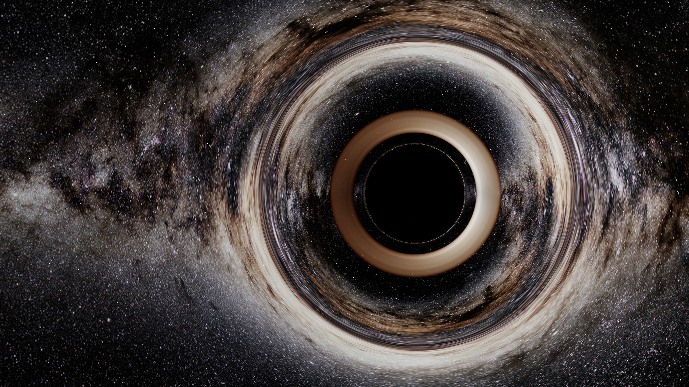

# Relativistic Black Hole Renderer

[English](./README.md) | **简体中文**

[](./LICENSE)

基于 **WebGPU / WebGL2** 的交互式相对论黑洞实时成像实验。根 URL 进入实时
双黑洞场景；旧 `?scene=binary-approx` URL 继续兼容，
`?scene=schwarzschild` 则进入交互式单黑洞场景。

根场景现在是面向实际运行的 **WebGPU 强场双黑洞光追器**。每个像素都在
逐帧冻结的 boosted superposed Kerr-Schild 近似度规中积分过去指向的零
Hamiltonian 光线，并明确分类为 `captured`、`escaped` 或 `unresolved`；
合并后平滑过渡到解析单 Kerr 余留体。鼠标或触摸改变相机后，下一次提交只
包含新相机光线，不读取固定 transfer map，也不会在 Metal 队列中堆积旧视角。

固定版本的 `SXS:BBH:0001` Lev5 数据只用于锚定复数 `h22` 波形、来源事件、
最终质量与自旋。渲染坐标由波形频率驱动的准圆 PN/EOB-like 适配器生成。
SXS 视在视界坐标质心的分离和相位仍作为带标签的证据显示，但**绝不成为
WebGPU 中的黑洞位置**。

这是一套强场 **approximate fast-light metric**，不是满足约束方程的完整
数值相对论时空。它不读取 SXS 近区度规，不沿单条光线演化时空，也不模拟
发光等离子体，因此不是 full-NR slow-light、GRMHD 或完整辐射转移。
WebGL2 会明确回退到旧 weak-field 预览，不以双后端一致为由限制 WebGPU/Metal。

显式 Schwarzschild 场景会在 GPU 上反向积分过去指向零测地线，并用同一条
光路计算视界捕获、理想薄盘交点、频移和全天球银河背景透镜成像。

科学入口 `?scene=transfer-map-reference` 使用项目生成的
stationary analytic **Schwarzschild 与 Kerr** 参考图验证 transfer-map
完整链路。Kerr 产品只采用固定 `SXS:BBH:0001` 余留体自旋；度规与像素均由
项目按解析 Kerr 解生成，不读取 SXS 近区时空。两者采用固定 1024×576
相机、不含吸积盘，也**不是数值相对论**。它们是校准与回归 oracle，不是
双黑洞合并渲染器。



<sub>项目在 Apple Silicon 上运行 WebGPU/Metal 的 5120×2576 实际截图，保留控制面板与后端、输出模式、帧率等运行状态。银河素材：ESO/S. Brunier；经本项目测地线追踪变形、合成并转码，原素材按 [CC BY 4.0](https://creativecommons.org/licenses/by/4.0/) 使用；完整来源见 [`assets/SOURCES.md`](./assets/SOURCES.md)。</sub>

## 产品层级与路线

| 产品层 | 状态 | 科学边界 |
| --- | --- | --- |
| 根 URL 实时双黑洞 | 已实现 | WebGPU 在 boosted superposed Kerr-Schild fast-light 近似中积分 3+1 Hamiltonian 光线；SXS 只锚定波形/事件/余留体 |
| `?scene=schwarzschild` | 已实现 | 交互式单黑洞 Schwarzschild 测地线与理想薄盘 |
| Stationary Schwarzschild/Kerr 工作台 | 已实现 | 固定相机解析真空校准、认证交付和回归 oracle；不是 merger renderer |
| WebGL2 双黑洞回退 | 已实现 | 明确标注的旧 weak-field 兼容预览，不声称与 WebGPU 强场路径物理等价 |
| 4D NR slow-light 极致离线渲染 | 规划中 | 需要 ray bundles/Jacobi；若要发光画面，还需独立来源的 GRMHD/GRRT、光谱和偏振数据 |

[`docs/rendering-modes.md`](./docs/rendering-modes.md) 详细定义两条开发路线、
允许的科学声明，以及为什么 transfer-map v1 只保持 camera-specific vacuum
escape-transfer ABI，而不是完整辐射渲染格式。

## 核心特性

- **交互式 Schwarzschild 测地线**：显式单黑洞场景使用 Störmer–Verlet 数值积分 `u'' = -u + 3u²`，而不是屏幕空间扭曲。
- **统一光路合成**：同一条光线负责黑洞捕获、多个盘面交点和天空逃逸方向，银河与恒星自然产生临界环和高阶像。
- **相对论薄盘显示**：包含 Schwarzschild 圆轨道频移、`g⁴` 总辐射强度变换、近似黑体色度、表面光学深度与肢暗化。
- **实时程序化盘面**：受盘湍流启发的有限寿命噪声场随局部 Kepler 角速度平流；它是视觉近似，不是 MHD 模拟。
- **来源锚定的双黑洞演化**：根场景按需加载从
  `SXS:BBH:0001/Lev5` 派生的 2,732 个样本、约 198 KiB 的紧凑轨迹：
  真实 A/B 视界质心坐标分离与相位、CoM 修正外推 `h22`、来源事件和精确
  余留体元数据。强场渲染器只接受波形、事件与余留体参数作为锚；质心通道
  仍是带标签、依赖规范的诊断量。
- **统一时空 Provider**：44-float 对齐 ABI 提供双体/余留体位置、速度、自旋、
  companion attenuation、数值保护与 C² 合并过渡；CPU oracle 与 WGSL 使用
  同一套 3+1 契约。
- **WebGPU 强场传播**：生产 shader 计算任意自旋 boosted Kerr-Schild 项、
  解析空间度规导数、lapse、shift 与 inverse spatial metric，再积分约化零
  Hamiltonian；合并后的精确极限是带 SXS 余留质量/自旋的单 Kerr。
- **失败即拒绝的光线结果**：在明确声明的 isolated-Kerr excision 与严格限定
  的 failure-only capture guard 之外，度规域错误、触及 regularization、
  null residual 超限或积分预算耗尽都会保留为醒目的 `unresolved`，绝不会
  被当成天空采样。
- **可交互时间控制**：可拖动波形时间轴、从两个播放按钮暂停/继续，并可
  开关合并阶段 `0.12×` 慢放。慢放只改变墙钟播放速度，不修改 source time
  或任何物理数据。
- **M3 Pro 画质锁定调度**：WebGPU 同时只允许一个 frame in flight，阻止旧
  相机画面排队。运动与拖动在 12 MP 上限内始终保留 Retina 原生 backing
  raster，并使用 72 步基础预算；耗时变长只降低吞吐，不再静默降低空间
  分辨率。暂停时保持同一 raster，并从 160 步细化到 288 步。
- **Schwarzschild / Kerr 校准工作台**：
  `?scene=transfer-map-reference` 会先认证两个内置 1024×576 stationary
  map 之一，再交给任一后端消费。Kerr 参考在精确解析 Kerr 度规中数值积分
  可分离零测地线，并使用有限距离 BL-ZAMO、恒 Kerr 半径扁球捕获面和到
  无穷远的延拓。这些 map 是离线管线的 stationary vacuum oracle，不是
  合并帧。
- **可检查的科学诊断**：稳定 URL 可显示天空、outcome、回溯时间、频移、
  null residual 或投影误差；点击 texel 可查看解码值与原始 32-byte 记录。
- **隔离的场景架构**：scene descriptor 与 shader bundle 隔离根双黑洞、显式 Schwarzschild 和固定相机科学参考，避免不同物理假设被静默混用。
- **WebGPU 生产路径、WebGL2 明确回退**：WebGPU/Metal 运行强场双黑洞；
  WebGL2 保留带标签的 weak-field 兼容预览，两者不冒充物理等价。
- **严格原尺寸天空资源**：ESO 摄影图固定以原始 6000×3000 上传，可选
  ESA/Gaia 全天图固定为 16000×8000；显式选择后不降采样，也不静默替换
  为更小贴图。
- **能力检测与 HDR 降级**：尝试请求 Display-P3、FP16 与扩展范围输出，并检查浏览器是否保留配置；否则依次退回 P3 SDR、sRGB SDR 或 WebGL2。

## 快速开始

项目没有构建步骤，也不需要安装 JavaScript 依赖。Python 仅用于启动静态服务器。

```bash
git clone https://github.com/ShuoleiWang/blackhole.git
cd blackhole
python3 -m http.server 4173
```

打开 <http://localhost:4173>。WebGPU 需要 `localhost` 或 HTTPS 安全上下文；不支持 WebGPU 时程序会自动尝试 WebGL2。

根 URL 直接进入实时双黑洞场景，旧
<http://localhost:4173/?scene=binary-approx> 选择同一场景。
打开 <http://localhost:4173/?scene=schwarzschild> 可进入交互式单黑洞场景；
打开 <http://localhost:4173/?scene=transfer-map-reference> 可进入固定相机
Schwarzschild transfer-map 参考；追加 `&reference=kerr-remnant` 可进入
stationary Kerr 余留体参考。所有路径彼此隔离。

仓库内的 6K 银河背景可以直接运行。若希望使用约 236 MiB 的 Gaia 16K 全天图，可额外执行：

```bash
./scripts/fetch_gaia_sky.sh
```

下载脚本会从 ESA 官方地址获取原图，并在安装前校验固定 SHA-256；该大文件不会提交到 Git。
观测参数面板现在提供醒目的“天空素材”选择器，可在 ESO 6000×3000 摄影图
与可选 Gaia 16000×8000 科学全天图之间切换，并保留当前场景、时间与渲染器
参数。两种选择都严格校验原尺寸；资源缺失、解码尺寸错误或硬件不支持时会
明确失败，不再加载低分辨率回退。

## 交互

| 操作 | 效果 |
| --- | --- |
| 鼠标拖动 / 单指拖动 | 改变观测相位与圆轨道所在平面 |
| 滚轮 / 双指缩放 | 改变观测半径 |
| 双击画面 | 重置观测视角 |
| 方向键 | 微调相位与轨道平面 |
| `0` | 令观测轨道与吸积盘共面，进入严格侧视 |
| `+` / `-` | 减小 / 增大观测半径 |
| 空格 | 暂停 / 继续模拟时间 |

单黑洞场景继续提供“科学真色 / 哈勃调色”显示变换。根强场双黑洞场景则在
同一区域以科学天空为主画面，并把坐标回溯、Hamiltonian residual 与积分
成本收进高级诊断。光线 outcome 与频移通道仍保留在 GPU 结果和固定相机
科学参考工作台中，不再占用双黑洞主控区域。

在根双黑洞场景中，拖动与缩放控制相机。每个实际渲染帧都会构造新的相机
光线并重算当前后端模型，不会采样固定相机 transfer map。WebGPU 运行强场
近似；强制或自动 WebGL2 回退会明确标为旧 weak-field 预览。
时间线按钮和空格键会暂停/继续同一播放状态；range 控件可拖动 protocol
time；“合并慢放”可在
`t = -160 M` 至 `t = 70 M` 启用仅用于展示的 `0.12×` 速度。波形条是真实
的 CoM 修正 SXS `Extrapolated_N2` `h22`，最大振幅对齐到 protocol
`t = 0`。暂停时间线和相机后，WebGPU 会逐档细化并累积带 sub-pixel jitter
的线性 HDR 结果。由于来源是真空双黑洞，吸积率控件会被禁用。

Transfer-map 工作台的相机与投影固定，因此拖动、缩放、重置、运动、质量、
吸积率和时间控件均禁用。它可以切换 Schwarzschild / Kerr 参考，并显示天空、
outcome、回溯时间、频移、null residual 或投影误差。点击画面可检查一条
32-byte 光线记录；方向键移动 texel，Shift 加速，Escape 关闭检查器。曝光和
画质仍只影响显示。

## 运行参数

| URL 参数 | 用途 |
| --- | --- |
| 根 URL | 打开交互式 WebGPU strong-field approximate 双黑洞光追 |
| `?scene=binary-approx` | 根双黑洞场景的旧版兼容别名 |
| `?scene=schwarzschild` | 打开交互式单黑洞 Schwarzschild 测地线与理想薄盘场景 |
| `?scene=transfer-map-reference` | 打开固定相机 stationary analytic Schwarzschild transfer-map 参考；非 NR、无吸积盘 |
| `?scene=transfer-map-reference&reference=kerr-remnant` | 打开 stationary analytic Kerr 余留体自旋参考；非 NR、无吸积盘 |
| `&binaryTime=-16.8&paused=1` | 在可复现的协议时间（单位 `M`）打开实时双黑洞场景，并保持时间线暂停 |
| `&diagnostic=sky\|outcome\|lookback\|frequency-shift\|null-residual\|projection-error` | 选择稳定的 transfer-map 诊断视图 |
| `?renderer=webgl` | 强制使用 WebGL2 回退路径 |
| `?hdr=0` | 关闭扩展 HDR，使用稳定的 SDR 输出 |
| `?sky=high` | 要求仓库内 ESO 全景图保持原始 6000×3000 |
| `?sky=ultra` | 要求本地 Gaia 全景图保持原始 16000×8000 |
| `?presentation=1` | 隐藏控制面板与状态栏，适合展示和截图 |

参数可以组合，例如：

```text
http://localhost:4173/?scene=transfer-map-reference&reference=kerr-remnant&diagnostic=outcome&renderer=webgl&hdr=0
```

## 渲染管线

显式 Schwarzschild 路径：

1. 从圆轨道观测者的局部共动标架生成相机光线。
2. 做 Lorentz 变换，进入局部 Schwarzschild 静态标架。
3. 在 fragment shader 中积分零测地线并判断捕获、逃逸和盘面交叉。
4. 按从近到远的顺序累积薄盘辐射与透过率，再采样逃逸方向上的全天球背景。
5. WebGPU 在 FP16 中间目标上完成光追，再根据实际显示能力输出扩展 HDR 或 SDR；WebGL2 提供 sRGB/SDR 回退。

根双黑洞路径会按需加载并校验 SXS manifest 与紧凑 sample asset。运行时
展开 CoM 修正复数 `h22` 相位，计算受限轨道频率，应用显式
`r/M=(MΩ)^(-2/3)` 准圆关系，再生成质心系位置与 boost 速度。从共同视界事件
到波形峰值使用 quintic Hermite 接续，保证值、一阶与二阶导数连续。依赖规范
的 SXS 质心分离/相位只用于带标签 UI 与回归，绝不进入 WebGPU body position。

WebGPU 每个像素先在局部 ADM 正交 tetrad 中构造相机方向，然后计算冻结的
光子到达相机时的反向、未来指向动量，再以负坐标时间步推进 Hamiltonian
流，从而回溯过去指向光路。随后计算冻结的 boosted-superposed Kerr-Schild
度规，将其分解为 lapse、shift 与空间度规，并积分

```text
H(x,p) = α sqrt(γⁱʲ pᵢ pⱼ) - βⁱpᵢ = -pₜ
```

自适应积分使用解析空间导数，并把光线终态保留为 captured、escaped 或
unresolved。逃逸光线从有限 escape sphere 到无穷远使用闭式弱场单极尾段，
频移使用守恒的无穷远能量。合并阶段的近似双体度规以 C² 方式过渡到解析 Kerr
余留体；只有物理状态和相机完全静止时，结果才会在线性 FP16 HDR 中累积。

这仍不是已求解的 SXS 近区时空：黑洞位置来自显式解析适配器，单条光线内冻结
度规，isolated-Kerr capture surface 只是 excision proxy，不是求出的视在/
事件视界。面向 deadline 的 `emergency` / `survival` / `interactive` 档采用明确声明的较大
capture padding 与较松积分预算；暂停后的 `fine` 是最严格的 settled 档。
这些策略用数值分辨率换延迟，不会提高底层模型的科学声明等级。WebGL2 则有意
接收旧 separation/phase 兼容 payload，并运行明确标注的 weak-field shader。

参考场景完成一条独立、失败即拒绝的链路：从源码内固定信任表选择产品；
认证 manifest 原始字节、sidecar 和全部 chunk；验证 v1 schema、32-byte
记录、坐标、outcome 与精度；将 589,824 条记录上传到 WebGPU 或 WebGL2；
运行时只取最近 texel、绝不跨捕获边界混合逃逸方向，并且只有 `escaped`
才采样天空；最后复用共享后处理和 HDR/SDR 输出。

两个产品都是 `r=40M` 观测者、40° 垂直视场、1024×576 单时刻投影。
Schwarzschild map 包含 557,772 条 escaped 和 32,052 条 captured 光线。
Kerr map 使用 `a/M = 0.686461676493`、有限距离 BL-ZAMO 和 ingoing
Cartesian Kerr-Schild manifest 坐标，包含 558,684 条 escaped 和 31,140
条 captured 光线。两者均无 unusable 记录，且都不是 NR 时空、双黑洞合并
画面、吸积盘或 GRMHD / 辐射转移结果。

这些参考会作为两条开发路线共同使用的 stationary regression oracle 保留。
实时路线继续在 GPU 上生成相机光线；未来离线路线需要 4D NR slow-light ray
bundles 与独立版本的辐射产品，而不会扩张 v1 32-byte vacuum ABI 的含义。

主要实现：

- [`src/main.js`](./src/main.js)：场景选择、相机 revision、单帧 GPU 背压、
  交互与动态画质编排
- [`src/shaders.js`](./src/shaders.js)：显式单黑洞场景的 WGSL / GLSL Schwarzschild 测地线、薄盘辐射、天空采样与后处理
- [`src/scenes/binary-approx-scene.js`](./src/scenes/binary-approx-scene.js)：
  根双黑洞生命周期、证据标签化 SXS 时间线、后端策略与强场逐帧参数
- [`src/scenes/binary-dynamics-adapter.js`](./src/scenes/binary-dynamics-adapter.js)：失败即拒绝的浏览器加载、完整性检查和确定性动力学插值
- [`src/scenes/binary-playback-clock.js`](./src/scenes/binary-playback-clock.js)：拖动、帧率无关播放、末尾停留、循环与仅展示慢放
- [`src/strong-field-orbit.js`](./src/strong-field-orbit.js)：波形相位展开、
  频率—半径轨道适配、C² 合并运动学与 provider frame
- [`src/strong-field-spacetime.js`](./src/strong-field-spacetime.js)：CPU
  Kerr-Schild / 3+1 物理 oracle、provider ABI、Hamiltonian 与失败即拒绝域检查
- [`src/strong-field-shaders.js`](./src/strong-field-shaders.js)：WebGPU 度规
  jet、局部相机 tetrad、Hamiltonian 光追、outcome、诊断、远场接续和显式
  WebGL2 fallback 声明
- [`src/strong-field-quality.js`](./src/strong-field-quality.js)：M3 Pro
  交互/细化调度、分辨率/步数滞回、revision 失效与累积策略
- [`src/binary-shaders.js`](./src/binary-shaders.js)：仅为明确 WebGL2 fallback
  保留的旧 weak-field 双黑洞 tracer
- [`src/scenes/transfer-map-reference-scene.js`](./src/scenes/transfer-map-reference-scene.js)：固定相机参考场景生命周期与失败即拒绝加载 UI
- [`src/transfer-map-loader.js`](./src/transfer-map-loader.js)：浏览器端 manifest、sidecar、chunk、ABI、outcome 与精度验证
- [`src/transfer-map-shaders.js`](./src/transfer-map-shaders.js)：WebGPU / WebGL2 最近 texel consumer
- [`assets/transfer-maps/schwarzschild-reference-v1/manifest.json`](./assets/transfer-maps/schwarzschild-reference-v1/manifest.json)：1024×576 可渲染解析参考及 9 个哈希 chunk
- [`scripts/generate_schwarzschild_transfer_map.py`](./scripts/generate_schwarzschild_transfer_map.py)：确定性离线生成器
- [`scripts/verify_schwarzschild_transfer_map.py`](./scripts/verify_schwarzschild_transfer_map.py)：独立 stationary physics 验证器
- [`assets/transfer-maps/kerr-remnant-reference-v1/manifest.json`](./assets/transfer-maps/kerr-remnant-reference-v1/manifest.json)：1024×576 可渲染解析 Kerr 参考及哈希 chunk
- [`scripts/generate_kerr_transfer_map.py`](./scripts/generate_kerr_transfer_map.py)：带完整光线 tolerance refinement 的确定性 Kerr 生成器
- [`scripts/verify_kerr_transfer_map.py`](./scripts/verify_kerr_transfer_map.py)：有限 ZAMO 阴影、Kerr-Schild 身份与独立 fixed-step 光线验证器
- [`docs/kerr-reference.md`](./docs/kerr-reference.md)：Kerr 配置、方程、验证边界与复现说明
- [`assets/scenes/binary-sxs-bbh-0001-v2.json`](./assets/scenes/binary-sxs-bbh-0001-v2.json)：Phase 2 来源、科学状态、事件、完整性、误差、渲染边界与播放 manifest
- [`assets/scenes/binary-sxs-bbh-0001-v2.samples.json`](./assets/scenes/binary-sxs-bbh-0001-v2.samples.json)：2,732 个样本的紧凑 SXS 动力学与波形轨迹
- [`scripts/generate_binary_sxs_dynamics.py`](./scripts/generate_binary_sxs_dynamics.py)：从三个固定官方 SXS 文件离线确定性生成轨迹
- [`scripts/verify_binary_dynamics.py`](./scripts/verify_binary_dynamics.py)：失败即拒绝的 Phase 2 来源、资产、事件、插值、余留体、渲染边界与播放检查
- [`tests/binary-playback.test.mjs`](./tests/binary-playback.test.mjs)：source anchor、插值、拖动、慢放、末尾停留与帧率无关性的 Node 测试
- [`assets/scenes/binary-pn-equal-mass-v1.json`](./assets/scenes/binary-pn-equal-mass-v1.json)：仅为回归保留的 legacy v1 PN/现象学资产
- [`scripts/verify_binary_preview.py`](./scripts/verify_binary_preview.py)：legacy PN 契约与未改变弱场 shader 的收敛回归
- [`docs/binary-model.md`](./docs/binary-model.md)：双黑洞科学边界、当前实时
  强场模型、显式 WebGL2 回退与离线架构
- [`docs/strong-field-equations.md`](./docs/strong-field-equations.md)：
  boosted Kerr-Schild provider、过去指向 Hamiltonian 约定、excision
  语义与 GPU frame ABI
- [`docs/strong-field-performance.md`](./docs/strong-field-performance.md)：
  M3 Pro 画质档、单帧背压、声明式数值权衡与渐进收敛
- [`docs/strong-field-ray-oracles.md`](./docs/strong-field-ray-oracles.md)：
  独立 CPU 解析极限、捕获/逃逸、自旋奇偶与失败即拒绝验收
- [`docs/rendering-modes.md`](./docs/rendering-modes.md)：已实现产品层级、实时
  strong-field 路线、离线 NR/GRRT 路线与科学声明等级
- [`docs/nr-transfer-map-v1.md`](./docs/nr-transfer-map-v1.md)：transfer map
  v1 协议的规范术语、字段语义、安全规则与阶段状态
- [`schemas/nr-transfer-map-v1.schema.json`](./schemas/nr-transfer-map-v1.schema.json)：机器可读的 transfer map manifest schema
- [`assets/transfer-maps/contract-fixture-v1/manifest.json`](./assets/transfer-maps/contract-fixture-v1/manifest.json)：项目生成的小型一致性 fixture；不含 NR 派生 payload
- [`scripts/generate_nr_contract_fixture.py`](./scripts/generate_nr_contract_fixture.py)：确定性重建一致性 fixture
- [`scripts/verify_nr_contract.py`](./scripts/verify_nr_contract.py)：失败即拒绝的 manifest、sidecar、坐标标架和逐光线记录验证器
- [`tests/test_nr_contract.py`](./tests/test_nr_contract.py)：协议正向与对抗性回归测试
- [`src/webgpu-renderer.js`](./src/webgpu-renderer.js)：WebGPU 单帧提交 gate、
  FP16 ping-pong 渐进累积与 HDR/P3 配置协商
- [`src/webgl-renderer.js`](./src/webgl-renderer.js)：WebGL2 硬件回退与半浮点 framebuffer 探测

## 模型范围与限制

| 场景 / 组件 | 已实现 | 当前边界 |
| --- | --- | --- |
| 显式单黑洞 | 非旋转 Schwarzschild 时空与 GPU 零测地线数值积分 | 不支持 Kerr 自旋和 frame dragging；最窄临界曲线仍受采样限制 |
| 显式 Schwarzschild 吸积盘 | `r = 6M` 至 `18M` 的理想零厚度表面、频移、近似发射与受湍流启发的结构 | 不含有限尺度高度、GRMHD、完整光谱、偏振或自洽辐射转移 |
| 双黑洞坐标动力学 | 波形频率锚定的准圆 PN/EOB-like 关系，解析生成质心系位置与速度 | 不是 calibrated EOB Hamiltonian；SXS 质心分离/相位只作依赖规范的 UI 证据 |
| 双黑洞波形 | CoM 修正 `Extrapolated_N2` 复数 `h22`，最大振幅对齐到 protocol `t = 0` | 远区波形不是近区度规，不能决定相机光线传播 |
| 双黑洞合并/余留体数据 | 共同视在视界事件 `t = -6.072285 M`；精确元数据余留质量 `0.951609417715 M`、自旋向量 `(-7.29520687012e-10, 7.40468371215e-10, 0.686461676493)` | C² metric removal 是解析过渡，不是重建的 NR 视界几何或 recoil |
| 双黑洞透镜 | 在 boosted superposed Kerr-Schild 项中逐像素积分 3+1 null Hamiltonian；合并后精确单 Kerr 极限包含 frame dragging | 强场但仍为逐帧冻结、未解约束的近似；capture surface 是 isolated-Kerr excision proxy |
| 双黑洞发射 | 无吸积盘的真空天空透镜 | 若加入发光等离子体，需要物理气体初始条件、GRMHD 与辐射转移 |
| Stationary Schwarzschild 参考 | 固定 1024×576 解析真空 map、认证 chunk、WebGPU/WebGL2 最近 texel playback | 固定相机；无吸积盘、NR 来源、时间插值或双黑洞 slow-light 光线 |
| Stationary Kerr 余留体参考 | 在 `a/M = 0.686461676493` 的精确解析 Kerr 度规中数值积分真空零测地线，并使用有限 BL-ZAMO、扁球 Kerr-r 捕获面、认证 playback 与诊断 | 只使用 SXS 余留体自旋参数；无 SXS 近区度规、双黑洞时间依赖、发射模型或 NR 派生像素 |
| NR transfer-map 协议 | 版本化 schema、合成 fixture、失败即拒绝验证器、参考 consumer 与回归测试 | consumer 只由解析数据验证；仓库仍无 NR 派生 transfer map |
| 共享渲染器 | WebGPU 强场生产路径、单 in-flight frame 与静止 FP16 累积；WebGL2 weak-field fallback | HDR、P3、FP16 与 16K 纹理由运行时能力决定；HDR/累积不提高底层度规精度 |

产品层级与两条开发路线见
[`docs/rendering-modes.md`](./docs/rendering-modes.md)；Schwarzschild
几何单位、临界轨道、侧视图像和颜色不对称见
[`docs/physics-notes.md`](./docs/physics-notes.md)；stationary Kerr 产品见
[`docs/kerr-reference.md`](./docs/kerr-reference.md)；双黑洞模型边界见
[`docs/binary-model.md`](./docs/binary-model.md)，实时强场实现的
[`度规与方程`](./docs/strong-field-equations.md)、
[`M3 Pro 调度`](./docs/strong-field-performance.md)和
[`独立光线 oracle`](./docs/strong-field-ray-oracles.md)另有专文。

## M3 Pro 兼容性与 HDR

当前硬件目标是 **M3 Pro**。程序会在运行时检查纹理上限、canvas format、
半浮点 framebuffer、显示动态范围和两种原尺寸天空素材；本文不再作单独的
M4 兼容承诺。ESO 6000×3000 与 Gaia 16000×8000 路径均纳入人工验收。

右上角状态栏显示实际后端、GPU、输出模式、已完成 frame 吞吐与内部渲染
分辨率。调度器仍禁止超过一个 WebGPU frame 在 Metal 中排队，但不再用降低
分辨率换取帧率。运动与拖动在 12 MP 上限内使用原生 device-pixel ratio 和
72 步基础预算；暂停时在相同 raster 上依次使用 160、288 步。例如
1280×720 CSS viewport 在 2× Retina 上渲染为 2560×1440，1836×1376 则为
3672×2752。该模式允许明显卡顿；completed-frame 计时只作遥测，不再拥有
降采样权限。

## 验证

渲染器本身没有构建步骤。验证套件另外要求 `PATH` 中存在当前版 Node.js；
如果只有 `verify_strong_field.py` 需要显式路径，可以设置 `NODE_BINARY`。

```bash
python3 scripts/verify_physics.py
python3 scripts/verify_binary_dynamics.py
python3 scripts/verify_strong_field.py
node --test tests/*.test.mjs
python3 scripts/verify_binary_preview.py
PYTHONDONTWRITEBYTECODE=1 python3 scripts/verify_nr_contract.py
PYTHONDONTWRITEBYTECODE=1 python3 -m unittest tests/test_nr_contract.py
PYTHONDONTWRITEBYTECODE=1 python3 scripts/verify_nr_contract.py assets/transfer-maps/schwarzschild-reference-v1/manifest.json
PYTHONDONTWRITEBYTECODE=1 python3 scripts/verify_schwarzschild_transfer_map.py
PYTHONDONTWRITEBYTECODE=1 python3 -m unittest tests/test_schwarzschild_transfer_map.py
PYTHONDONTWRITEBYTECODE=1 python3 scripts/verify_nr_contract.py assets/transfer-maps/kerr-remnant-reference-v1/manifest.json
PYTHONDONTWRITEBYTECODE=1 python3 scripts/verify_kerr_transfer_map.py
PYTHONDONTWRITEBYTECODE=1 python3 -m unittest tests/test_kerr_transfer_map.py
node --test tests/transfer-map-runtime.test.mjs
```

需要重建内置参考资产时，先运行：

```bash
python3 scripts/generate_schwarzschild_transfer_map.py
python3 scripts/generate_kerr_transfer_map.py
```

Schwarzschild 数值回归覆盖：

- 临界冲量参数 `b_c = 3√3 M`
- 弱场偏折与 `4M/b` 的一致性
- 有限距离观察者的阴影角直径
- 零测地线积分守恒量
- 184 / 288 步实时预算下的捕获与逃逸行为

Phase 2 双黑洞验证器会按 URL、大小、MD5 和 SHA-256 固定三个官方来源文件；
检查 2,732-sample sidecar 的哈希和 schema；确认 SXS 事件顺序、`h22` 峰值
位于 `t = 0`、共同视界位于 `t = -6.072285 M`、精确元数据余留体参数、
严格 validity 的视界后保持策略，以及全部声明插值界。实测最大轨道相位插值
残差为 `6.442e-4 rad`。Node 测试覆盖事件 anchor、有限插值、scrub clamp、
仅展示慢放、确定性循环/末尾停留和帧率无关性。

强场测试会独立检查 Minkowski 与精确单 Schwarzschild Kerr-Schild 极限、
Kerr 自旋奇偶性/frame-dragging 符号、宽分离单极极限、companion attenuation、
Lorentz covector boost、C² 余留过渡、3+1 null 构造、Hamiltonian 导数、
regularization、失败即拒绝 outcome、GPU ABI、局部 ADM 相机 tetrad、有限球
远场接续、revision-safe 累积与单帧 WebGPU submission gate。另有测试把 SXS
质心分离/相位改写或设置为不可读取，证明它们不能改变强场黑洞坐标。

Legacy 双黑洞回归只服务 WebGL2 兼容 shader，不能验证 WebGPU 强场模型；
反之，新 oracle 与浏览器检查通过也只验证声明的解析/数值性质，不代表 NR
光传播、满足约束的双黑洞时空、slow-light 或唯一的定量合并重建。

NR 契约检查严格 JSON/schema、一致的 sidecar 哈希与大小、可移植 artifact
定位规则、连续有序 chunk、物理系统与 source/protocol 时间声明、互逆的空间
仿射标架、正确的 ICRS 旋转、观测者 tetrad 正交归一性、光线积分与边界语义，
以及合法且有限的逐光线结果。数据声明可渲染前，还会把 outcome fractions
与解码记录交叉核对。未知或缺失字段、重复键、非有限数、路径越界和含混的
无效光线状态会被拒绝。验证通过表示 **protocol-conformant**，不表示
**NR-backed** 或 **physically validated**。

Schwarzschild verifier 会独立恢复有限距离阴影直径 `14.548010°` 与边界频移
`g = 1.024951860`，并报告最大采样解析 null residual `7.678e-14`、最大独立
方向误差 `1.062e-8 rad`、最大逐光线投影估计 `1.415e-2 px`。这些是
stationary reference 检查；NR 收敛阶与约束范数字段为 `not-applicable`，
不是数值为零的 NR 测量。

Kerr verifier 会独立重建 Cartesian Kerr-Schild 度规与 BL-ZAMO tetrad，
计算有限距离 spherical-photon 临界曲线、检查完整 capture mask，并用
fixed-step RK4 重追代表性完整光线。更完整的 Kerr 验证套件另用生成器级单元
回归检查 Schwarzschild 极限与自旋翻转镜像；独立 verifier 检查第一积分分离、
无穷远尾段、null residual 与逐记录投影门槛。内置 map 的解析 capture-mask
mismatch 为 0，最大 stored null residual 为 `3.068e-9`，p95 / 最大投影估计为
`1.929e-4 / 3.752e-3 px`，最大独立方向误差为 `8.679e-9 rad`。精确模型与验收边界见
[`docs/kerr-reference.md`](./docs/kerr-reference.md)。

这些检查共同覆盖一组明确的数值性质与架构契约，但不等价于完整画面、辐射模型或所有 GPU 的自动化验证。当前仓库尚未配置 GPU 图像回归 CI。

## 天空素材与署名

- **ESA/Gaia/DPAC · A. Moitinho**：可选 16000×8000 Gaia EDR3 全天图，CC BY-SA 3.0 IGO。
- **ESO/S. Brunier**：仓库内置 6000×3000 银河摄影背景，CC BY 4.0。

下载地址、处理方式、哈希和完整许可信息见
[`assets/SOURCES.md`](./assets/SOURCES.md)。第三方素材不会因本项目采用 MIT
许可证而被重新授权。

## 许可证

本项目的原创源代码采用 [MIT License](./LICENSE)。

第三方天空素材、SXS 派生数据、transfer-map 来源数据与 vendored 依赖不因
本项目采用 MIT 许可证而被重新授权，仍分别遵循各自的来源条款。Phase 2
使用的固定 Zenodo record 没有声明许可证；本仓库只记录该来源状态，不虚构
SPDX 标识，也不从其他页面推断许可证。完整来源与许可信息见
[`assets/SOURCES.md`](./assets/SOURCES.md)。
